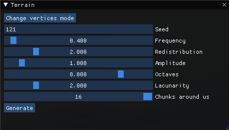

# Procedural Terrain with OpenGL

This project is a procedural terrain generation application using OpenGL, SFML and ImGui. It was developed in 2023 over two months by Valentin, Pierre, and myself as part of our studies to learn OpenGL and procedural generation techniques.

You can download the game binaries from the [latest release](https://github.com/P0ulpy/procedural-terrain-with-opengl/releases/latest)

## Features

- **Procedural Terrain Generation**: The terrain is generated using Perlin noise, allowing for realistic and varied landscapes.
- **Real-time Rendering**: The terrain is rendered in real-time using OpenGL, providing smooth and interactive visuals.
- **Camera Control**: Navigate the terrain using a first-person camera with keyboard and mouse controls.
- **User Interface**: An intuitive UI built with ImGui for displaying information and interacting with the application.
- **Skybox**: A skybox is implemented to enhance the visual experience.
- **Dynamic Terrain Updates**: The terrain updates dynamically as the camera moves, generating new chunks as needed.
- **Elevation-based Texturing**: Textures are applied relative to elevation, with water for low areas, grass for mid-level areas, rock for higher elevations, and snow for the highest peaks.

## Showcase

### Terrain


### User Interface


## Controls
- **W** : Move forward
- **S** : Move backward
- **A** : Move left
- **D** : Move right
- **Space** : Move up
- **Left Shift** : Move down
- **Mouse** : Look around

## Build from sources

This repo toolchain as been created using my [cmake and vcpkg template](https://github.com/P0ulpy/cmake-vcpkg-template).

### Bootstrap workspace

**Windows :**

Make sure you installed [Visual Studio](https://visualstudio.microsoft.com/) with [C and C++ support](https://learn.microsoft.com/cpp/build/vscpp-step-0-installation?view=msvc-170#step-4---choose-workloads) and [C++ linux development with cmake](https://learn.microsoft.com/cpp/linux/download-install-and-setup-the-linux-development-workload?view=msvc-170#visual-studio-setup).
Make sure you installed [CMake](https://cmake.org/download) as well.

**GNU/Linux (apt) :**

Install necessary build tools and a C/C++ compiler
```sh
sudo apt-get update
sudo apt-get install cmake build-essential tar curl zip unzip autoconf libtool g++ gcc
```

Then run the bootstrap script
```sh
# Unix
./scripts/bootstrap-workspace.sh
# Windows
.\scripts\bootstrap-workspace.bat
```

**Generate the cmake project :**

```sh
# For debug build
# Unix
./scripts/generate-cmake-debug.sh
# Windows
.\scripts\generate-cmake-debug.bat

# For release build
# Unix
./scripts/generate-cmake-release.sh
# Windows
.\scripts\generate-cmake-release.bat
```

**Compile :**

```bash
# For debug build
# Unix
./scripts/build-debug.sh
# Windows
.\scripts\build-debug.bat

# For release build
# Unix
./scripts/build-release.sh
# Windows
.\scripts\build-release.bat
```

**Run the program**

You can now run the compiled program by looking into `out/Debug` or `out/Release`.
The out directory hierarchy will be different depending on your generator.

For exemple with Make generator in Debug mode run your program like that
```bash
# Unix like
./out/Debug/Game/Game
# Windows
.\out\Debug\Game\Game.exe
```

## License
This project is open-source and available under the MIT License. See the [LICENSE file](LICENSE) for details.

## Acknowledgments
- This project was developed as part of our studies to learn OpenGL and procedural generation techniques.
- Special thanks to our instructors and peers for their support and feedback.